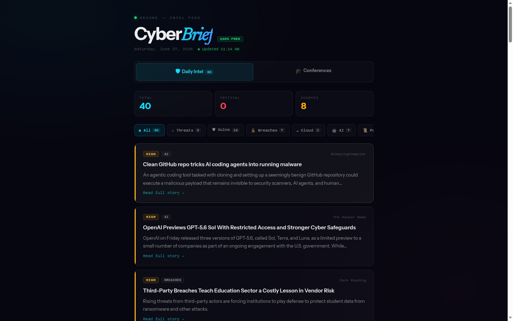

<p align="center">
  
</p>

<h1 align="center">📋 Solomon's CyberBRIEF</h1>

<p align="center"><strong>AI-powered cyber threat intelligence research and reporting.</strong></p>

<p align="center">
  <a href="https://solomonneas.dev/projects/cyberbrief"></a>
</p>

<p align="center">
  
  
  
  
  
  
  
</p>

CyberBRIEF transforms raw threat data into executive-grade BLUF reports with MITRE ATT&CK mapping, IOC extraction, and academic citations. Three research tiers provide flexibility from free open-source intelligence to deep AI-powered research.



---

## Features

- **Three Research Tiers** - Free (Brave + Gemini), Standard (Perplexity Sonar), Deep (Perplexity Deep Research)
- **Flexible Source Input** - URLs, raw text, or PDFs fed directly into synthesis
- **BLUF Executive Summaries** - Bottom-Line-Up-Front format for instant clarity
- **MITRE ATT&CK Mapping** - Automatic technique identification with Navigator layer export
- **IOC Extraction** - IPs, domains, file hashes, CVEs, and URLs automatically parsed
- **Academic Citations** - Chicago Notes-Bibliography format
- **Threat Actor Profiling** - Rich profiles with confidence assessments
- **Export Options** - Markdown and HTML report export
- **TLP Banners** - Traffic Light Protocol classification for every report
- **5 Theme Variants** - Visual themes for different presentation contexts

---

## Quick Start

```bash
git clone https://github.com/solomonneas/cyberbrief.git
cd cyberbrief

# Backend
pip install -r backend/requirements.txt

# Frontend
cd frontend && npm install && npm run dev
```

Frontend: **http://localhost:5188**
Backend: **http://localhost:8000**

---

## Tech Stack

| Layer | Technology | Purpose |
|-------|-----------|---------|
| **Frontend** | React 18 | Interactive UI |
| **Language** | TypeScript 5 | Type safety |
| **Styling** | Tailwind CSS 3 | Utility-first CSS |
| **State** | Zustand | Global state management |
| **Bundler** | Vite 5 | Dev server with API proxy |
| **Backend** | FastAPI | Async REST API |
| **AI** | Gemini Flash | Report synthesis (free tier) |
| **Search** | Brave Search API | Open-source intelligence (free tier) |
| **Deep Research** | Perplexity API | Standard and deep research tiers |
| **Storage** | SQLite | Report persistence |

---

## Research Tiers

| Tier | Sources | AI Model | Use Case |
|------|---------|----------|----------|
| **Free** | Brave Search | Gemini Flash | Quick lookups, no API cost |
| **Standard** | Perplexity Sonar | Sonar | Deeper research with citations |
| **Deep** | Perplexity Deep Research | Deep Research | Comprehensive multi-source analysis |

---

## Project Structure

```text
cyberbrief/
├── backend/
│   ├── main.py                # FastAPI entry point
│   ├── models.py              # Pydantic models
│   ├── research/              # Research tier implementations
│   ├── report/                # Report generation
│   ├── attack/                # MITRE ATT&CK mapping
│   ├── export/                # Export handlers (MD, HTML)
│   └── requirements.txt
├── frontend/
│   ├── src/
│   │   ├── api/               # Backend API client
│   │   ├── components/        # UI components
│   │   ├── context/           # React context providers
│   │   ├── hooks/             # Custom hooks
│   │   ├── pages/             # Page views
│   │   ├── stores/            # Zustand state
│   │   ├── types/             # TypeScript interfaces
│   │   └── variants/          # 5 theme variants
│   ├── vite.config.ts
│   └── package.json
├── docs/
│   ├── ARCHITECTURE.md
│   ├── CONFIGURATION.md
│   └── assets/
├── Dockerfile
├── railway.json               # Railway deployment config
└── fly.toml                   # Fly.io deployment config
```

---

## Deployment

CyberBRIEF includes deployment configs for Railway and Fly.io:

- **Railway**: `railway.json` with auto-deploy
- **Fly.io**: `fly.toml` with Dockerfile
- **Docker**: `Dockerfile` for containerized deployment

See [CONFIGURATION.md](docs/CONFIGURATION.md) for environment variables and API key setup.

---

## Documentation

| Document | Purpose |
|----------|---------|
| [ARCHITECTURE.md](docs/ARCHITECTURE.md) | Tech stack, data flow, tier mechanics, frontend/backend split |
| [CONFIGURATION.md](docs/CONFIGURATION.md) | Environment variables, API key setup, port configuration |

---

## License

MIT. See [LICENSE](LICENSE) for details.
